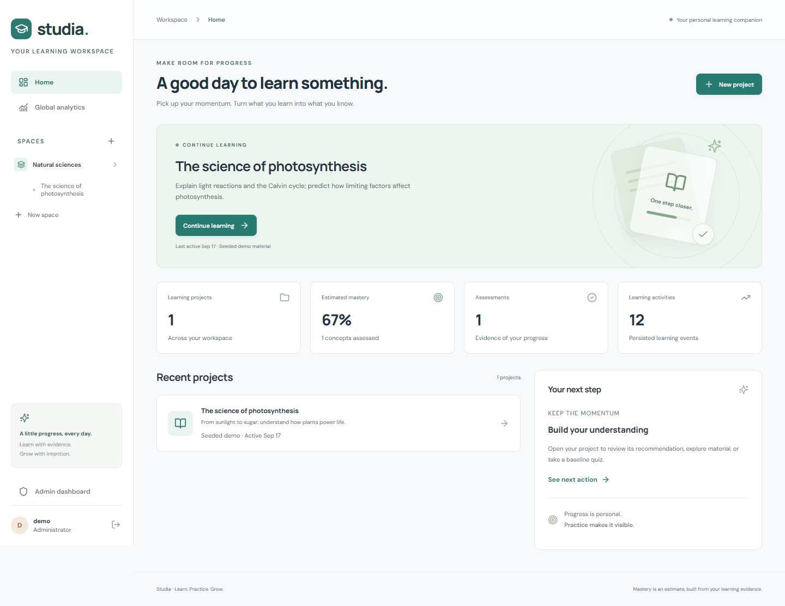

# Studia - AI Study Companion

A focused study workspace with private Spaces/Projects, PDF evidence, a grounded AI Tutor, adaptive practice, mastery estimates, and operational analytics. Implements the supplied PRD's Must Have scope and explicit user requirements.

[View the recorded demo](docs/demo.mp4) · [Verification and blockers](docs/VERIFICATION.md)



## Run locally

Requirements: Python 3.12+, Node 22+, and PostgreSQL 16+ with pgvector for the deployment path. A SQLite fallback is available for local development and smoke tests only.

1. Copy `.env.example` to `.env`; set your Gemini key and `DEMO_PASSWORD`. Never commit `.env`.
2. `python -m venv .venv`
3. Activate the environment; `pip install -r backend/requirements.lock`.
4. `cd frontend && npm ci && npm run build`, then return to the root.
5. `python backend/manage.py migrate`
6. `python backend/manage.py collectstatic --noinput`
7. Optional labeled demo: `python backend/manage.py seed_demo --admin`.
8. In separate terminals: `python backend/manage.py runserver 127.0.0.1:8000 --noreload` and `python backend/manage.py worker`.
9. Open http://127.0.0.1:8000. Sign in as `demo` with your `DEMO_PASSWORD`, or register a new learner.

On Windows, `scripts/start-local.ps1 -Seed` installs, builds, migrates and starts the processes. For frontend development, run `npm run dev` in `frontend`; Vite proxies `/api` to port 8000.

The demo seed creates only labeled material and upload events. It does not invent quizzes, mastery, conversations, scores, or AI usage. The worker must actually process the PDF. `docs/demo-material.pdf` is the repeatable three-page study fixture.

## PostgreSQL and Docker

Copy `.env.example`, set a strong `POSTGRES_PASSWORD`, provider key, secret key and allowed hosts, then run:

```sh
docker compose up --build -d
docker compose exec web python manage.py seed_demo --admin
```

Compose runs pgvector/PostgreSQL, a migration/static collection task, Django/Gunicorn, and a persistent worker. Database and private material storage use durable named volumes. Web and worker share the private material volume. The database is not exposed publicly. The migration enables the vector extension.

For a public VM deployment, install Docker Compose, point a DNS name at the VM, set `DEBUG=0`, `DOMAIN=your-domain`, `ALLOWED_HOSTS=your-domain`, `CSRF_TRUSTED_ORIGINS=https://your-domain`, a random `DJANGO_SECRET_KEY`, and `SECURE_SSL_REDIRECT=1`. Run `docker compose -f compose.yaml -f compose.public.yaml up --build -d`. Caddy terminates HTTPS; permit ports 80/443. Do not expose the internal API port directly. Back up the database and media volumes together. Do not run the demo seed on a public instance with a shared/weak password.

Public hosting requires an authorized VM or container hosting account with persistent storage and a worker process. GitHub alone does not host this Python/database application. See `docs/VERIFICATION.md` for actual deployment status; configuration is not a deployment claim.

## Verification

```sh
python backend/manage.py test study --verbosity 1
python backend/manage.py evaluate_ai --project 1
cd frontend
npm run build
# Set DEMO_PASSWORD in the shell. Server and worker must be running.
node verify-browser.mjs
```

Backend tests use mocked AI outputs where indicated. The live evaluation performs real provider calls against the labeled demo project, persists results for the admin dashboard, and writes `docs/evaluation-results.json`. The full learning-loop browser test uses real HTTP and AI calls, with no network mocks. Chrome must be installed, or change the Playwright launch channel. Set `RECORD_VIDEO=1` to record if Playwright's FFmpeg is available.

`docs/evaluation-cases.json` describes the repeatable six-case evaluation. Evaluation actions are real, persisted activity in the demo project. Browser verification creates a separate clearly named verification workspace.

## Features and design

- Session authentication, CSRF protection, server-side learner/admin roles, ownership checks on all resources and private PDF delivery.
- Project-local chunk retrieval with exact quote/document/page validation. Tutor includes a bounded conversation window, goals and compact persisted mastery context.
- PDF jobs persist in PostgreSQL. Atomic claims, lease fencing, stale lease recovery, bounded retries, explicit failure states and user retry controls survive browser closure.
- Adaptive selection combines mastery, low-score history, recent performance, topic exposure, recent Tutor activity and time since evidence. Both MCQ and rubric-scored open answers update mastery atomically.
- Unique request/event keys and one assessment per question make retried submissions idempotent. Assessment transactions update evidence, mastery, learning context and actionable recommendations together.
- Responsive Home, Materials, Tutor, Quiz, Growth, Analytics and admin screens with real data, empty/error/loading/retry states, source links and mobile navigation.
- AI calls record model, feature, latency, provider token usage, configured cost estimates, failures and retrieved chunk references.

Read `docs/ARCHITECTURE.md`, `docs/AI_USAGE.md`, `docs/DEVELOPMENT_PROMPTS.md`, `docs/VERIFICATION.md`, and `docs/DEMO.md` for submission details and limitations.

## Should Have features

The page-20 scope is implemented: streaming Tutor drafts with validated final answers, layout/table extraction, assessment breakdowns, saved Tutor topic memory, background evidence-based insights, retrieval caching, AI trace inspection, Gemini/OpenAI adapters, automated regression evaluation and checkpointed retries. See [the checklist](docs/CHECKLIST.md) and [architecture](docs/ARCHITECTURE.md) for precise scope. OCR and image interpretation are not included.

After upgrading, run migrations and restart both the web process and worker. Previously processed PDFs retain their existing extraction; newly processed documents use layout/table extraction.

```powershell
.venv/Scripts/python.exe backend/manage.py migrate
.venv/Scripts/python.exe backend/manage.py evaluate_regression
cd frontend
node verify-should.mjs
```

The browser script uses the demo password from the ignored local `.env` and an installed Chrome. It exercises real persisted data and unsupported-question streaming without a provider call. Full live streaming verification remains blocked by the accepted Gemini quota limit; public hosting access is still missing.
