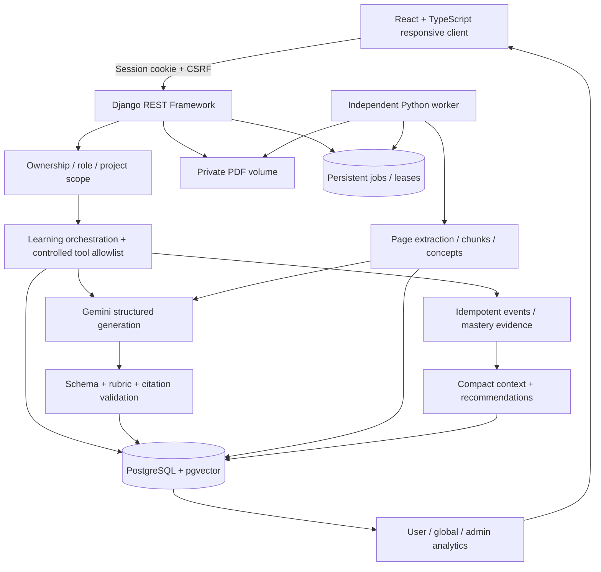
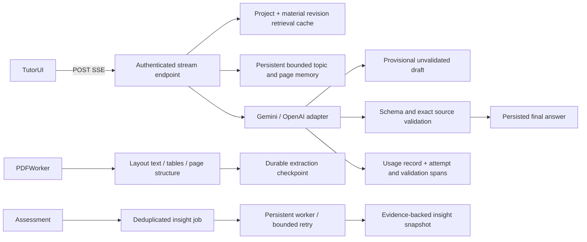

# Architecture and decisions

## Boundaries

The frontend has no provider keys or database access. All resource access flows through DRF session authentication and project ownership filters. Admin has a separate read-only platform analytics endpoint, not permission to silently act as another learner. Every job stores its owner and verifies the project's owner before processing. PDF paths are random and private; authenticated endpoints stream them with no-store and sandbox headers.

AI tools are allowlisted, strictly typed requests: search_materials, learning_state and assessment_history. Each call reauthorizes its project. Application orchestration, rather than the model, decides mutations. Unknown tools/extra keys/foreign project IDs are rejected. Uploads, questions, goals and learner answers are explicitly untrusted data in prompts. AI never receives an SQL executor or unrestricted filesystem/network tool.

## Retrieval

Page-aware layout chunks preserve line spacing up to roughly 2,200 characters; extracted tables receive separate chunks of up to 4,000 characters. A 256-dimensional signed token-hashing representation is persisted in pgvector; PostgreSQL cosine distance retrieves candidates, then lexical overlap ranks and gates them. This deliberately uses a deterministic sparse-style representation, not a falsely labeled semantic embedding model. The local SQLite path uses the same lexical gate over at most 3,000 chunks. Candidate retrieval is project-scoped before ranking. Source IDs and exact contiguous quotations must match retrieved chunks before being returned. This verifies provenance, not the logical entailment of every generated sentence; the small live evaluation checks a known grounded answer.

## Jobs and events

A document checksum is unique per project, and the job has a one-to-one constraint to its material. A conditional update claims a queued job with a UUID lease. The worker commits only if it still owns the lease. A ten-minute expired lease can be recovered. Provider failures back off and retry up to three attempts. Corrupt, encrypted, oversized and scanned-only PDFs fail with actionable messages. Retries reuse chunk IDs so citation references remain stable. Up to 24 chunks sampled across the document bound concept-extraction cost.

Long PDF work uses the worker; short learning-state/recommendation updates run in the same transaction as assessment completion. This preserves consistency without adding optional background learning-insight infrastructure. Database uniqueness deduplicates events and question submissions; row locks serialize mastery changes on PostgreSQL. Concurrent duplicate generation can consume extra provider calls, but only one logical question/message or assessment is persisted. Single-worker SQLite is only a development fallback.

## Learning state

Mastery starts at an explicitly unassessed 0.5 prior. Each assessment updates `(prior * (2 + evidence_count) + score * difficulty_weight) / (2 + evidence_count + difficulty_weight)`. Foundation/application/reasoning weights are 1/1.2/1.4. Unassessed priors are excluded from aggregate mastery and displayed as 'Not assessed'. This transparent estimate is not a calibrated psychometric measurement. Scores below 0.6 record mistakes. Selection combines current mastery, mistake count, new-concept coverage, recent question repetition, recent Tutor source exposure, recent assessment average and age of evidence.

Open-ended grading requires the exact rubric criteria, bounded per-criterion scores and explanatory feedback; the server computes the mean, preventing arbitrary overall scores. MCQ answers use server-held correct choices. Before/after mastery and assessment history remain inspectable. Recommendations are deterministic and evidence-based, avoiding needless model cost. Compact project context retains strengths, weaknesses, repeated mistakes, goal and the last five assessment summaries; Tutor also gets only four recent turns.

## Reliability and limits

The provider adapter uses TLS verification, timeouts, three bounded attempts on transient errors, Pydantic schemas and explicit failure responses. Production runs behind HTTPS with secure cookies. Settings reject missing production secrets. Per-user/anonymous throttling is a prototype safeguard, not a distributed abuse prevention system. Results are bounded; full cursor pagination and distributed throttling are future scaling work, not implemented features.

## Should Have architecture extension

Streaming runs provider work in a bounded pool (four active streams per process) and emits SSE drafts. Drafts are visibly provisional, never stored as final answers, and removed on errors. Final citations undergo the same validation as nonstreaming answers. Disconnects do not cancel work; replaying a completed request key recovers the saved answer. Simultaneous duplicates may still perform redundant provider calls, while database constraints keep final messages/events unique. This prototype uses WSGI streaming; deploy enough workers for long-lived responses.

Retrieval cache keys hash project-local material IDs/digests/status, query, limit and retrieval version. Hits recheck ready-material ownership; successful processing invalidates project entries. Entries expire after ten minutes and the worker removes expired rows. No generated-answer cache or cross-user cache exists.

Tutor memory is deterministic and extractive: last eight short questions, up to twelve cited document/page labels and turn count, plus existing assessment context. It is treated as untrusted context, not evidence or instructions. No provider-generated summary is claimed.

Insight jobs are deduplicated by project/revision. The worker compares the latest five assessment scores with the previous five and counts missing concepts over up to forty attempts. It saves the evidence IDs and method. Lease fencing and three-attempt budgets protect PDF and insight jobs; PDF extraction is checkpointed before provider concept extraction. PDFs with images or scans remain explicitly unsupported for visual interpretation/OCR. Table extraction works best with clearly ruled digital tables; complex layouts may require source review.

AI trace rows include a correlation UUID, provider/schema/prompt version, attempt status/latency, retrieved source IDs and validation outcome. They intentionally omit raw prompts, document bodies, credentials and reasoning traces. Analytics groups concepts by IDs as well as display names, preventing same-name projects from merging.
